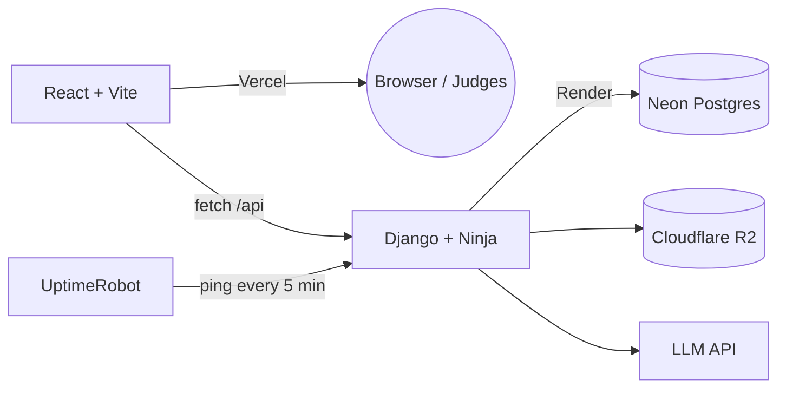

# [SiviHack26] Hackathon Tech Stack & Guide

---

## 1. The Final Stack

| Layer | Choice | Cost | Role |
|---|---|---|---|
| Frontend | React (Vite) | Free | UI, hosted as static build |
| Frontend hosting | Vercel | Free | Instant deploys, preview URLs per branch |
| Backend framework | Django + Django Ninja | Free | REST API, async-friendly, auto Swagger docs |
| Backend hosting | Render (Web Service, free tier) | Free | Runs the Django app |
| Database | Neon Postgres | Free | Structured data — users, sessions, app data |
| File / object storage | Cloudflare R2 | Free (10 GB) | Uploads, generated files, exports |
| Uptime / keep-warm | UptimeRobot | Free | Pings `/api/health` every 5 min |
| AI provider | Anthropic or OpenAI API (your keys) | Pay-as-you-go | Swappable behind one wrapper module |
| Source control / CI | GitHub → auto-deploy to Render & Vercel | Free | Push to `main` = live in ~1–2 min |



## 2. Repo structure

```
project-root/
├── frontend/ # React + Vite
│ ├── src/
│ ├── .env.example
│ └── vercel.json
├── backend/ # Django + Ninja
│ ├── config/ # settings, urls, wsgi/asgi
│ ├── core/ # health check, shared utils
│ ├── api/ # your feature endpoints (topic-specific)
│ ├── ai_client/ # LLM provider wrapper (topic-agnostic)
│ ├── storage_client/ # R2 upload/download helpers
│ ├── manage.py
│ ├── requirements.txt
│ ├── render.yaml
│ └── .env.example
└── README.md
```

