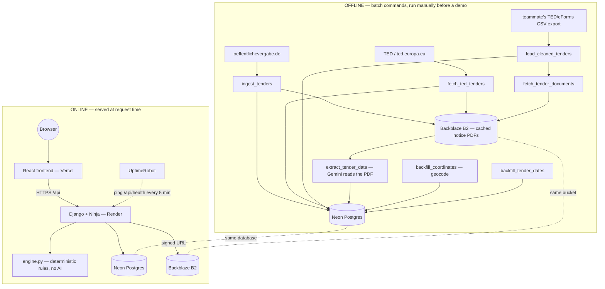

# Tender AI Screening

**SiviHack 2026 — Arctis AI Challenge: "Three Out of Forty — Which Tenders Are Worth Bidding On?"**

* Live App: **https://sivihack26.vercel.app**
* Live API: https://sivihack26.onrender.com/api/docs

---

## 1. What This Is

A small German construction company gets roughly forty new public tenders a week and can realistically bid on about three of them. Reading every notice in full — the actual PDF, not just the title — takes time nobody has, so in practice most tenders get screened on title and location alone, which throws away real bids and lets through ones the company was never going to qualify for anyway (wrong contract size, missing a mandatory reference, outside the bonding capacity).

[Find out more here.](./track02-challenge-sheet.pdf)

This system replaces that gut-check with a **deterministic rule engine** that decides fit against a company's actual hard constraints — operating radius, contract value range, guarantee/bonding ceiling, required references, excluded capabilities. AI (Google Gemini) is used **only** to read the tender's source PDF and extract structured facts (the guarantee amount, the required references, per-lot terms) with a citation back to the page it came from. It is never asked "does this tender look like the kind of work this company does" and never gets a vote in the accept/reject decision.

AI stays in the pipeline where it's good at reading unstructured text, and the accept/reject boundary — the part a bid manager has to actually trust — stays 100% inspectable Python with a machine-checkable reason for every verdict.

---

## 2. Architecture



The offline half runs **before** a demo, against real ingested data, and never touches the live request path. 

The online half is everything a user's click actually triggers: 
* the frontend calls `/api/screen/{company_id}`, 
* the backend reloads the already-ingested/extracted `Tender`/`Lot` rows from Postgres, runs `engine.py` (pure Python, zero network calls, zero AI) 
* and returns verdicts. 
 
Nothing in the online path calls Gemini or any external tender source — screening a company is instant and repeatable because all the slow work already happened offline.

---

## 3. Repo Structure

```
sivihack26/
├── backend/                       # Django + Django Ninja API
│   ├── config/                    # settings.py, urls.py, asgi/wsgi — Django project shell
│   ├── core/                      # /api/health — used by UptimeRobot's keep-warm ping
│   ├── api/                       # the actual product: models, rule engine, endpoints
│   │   ├── models.py              #   Company, Tender, Lot, Verdict
│   │   ├── engine.py              #   pure-Python deterministic rule engine (see §4)
│   │   ├── geo.py                 #   haversine distance + geocoding (city dict + Nominatim)
│   │   ├── pdf_cache.py           #   shared PDF-fetch/placeholder-detection/date-parsing helper
│   │   ├── services.py            #   orchestrates engine.py against ORM data, serializes API responses
│   │   ├── routers.py             #   the 4 HTTP endpoints (companies, screen, results)
│   │   ├── schemas.py             #   Ninja/Pydantic request+response shapes
│   │   ├── migrations/            #   Django schema history
│   │   └── management/commands/   #   every offline batch command — see §5
│   ├── ai_client/                 # thin Gemini wrapper (model, prompt→JSON, no other logic)
│   ├── storage_client/            # thin Backblaze B2 (S3-compatible) wrapper
│   ├── database/                  # a teammate's raw-SQL ETL scratch space — see §5
│   │   ├── raw_data/, clean_data/ #   original + cleaned TED/eForms CSV export
│   │   ├── data_cleaning.py       #   produces clean_data/ from raw_data/
│   │   └── schema.sql             #   the (now-retired) raw-SQL schema this was designed against
│   ├── requirements.txt
│   └── manage.py
├── frontend/                      # React 19 + Vite
│   └── src/
│       ├── components/            # TenderCard, ResultsBoard, ReasonDistributionChart, ...
│       ├── i18n/                  # EN/DE/VI dictionaries + reason-sentence templates
│       └── lib/                   # grouping.js, dateFilters.js, reasonCategories.js, format.js
├── LICENSE                        # MIT
└── README.md                      # this file
```

---

## 4. How The Rule Engine Works?

`backend/api/engine.py` is deterministic, pure Python, with **zero** Django/ORM/LLM dependency — `evaluate(item, company)` takes two plain data classes: 
* `ScreenItem`
* `ScreenCompany` 
  
and returns a tuple of:

* `verdict`, 
* `reason_code`. 
 
The same function screens a whole tender and each of its lots individually, since a lot can be worth bidding on even when the full package isn't (and vice versa).

Rules run in this order, first hard-fail wins:

| # | Rule | Reason code | Verdict |
|---|---|---|---|
| 1 | Distance to the tender exceeds the company's operating radius | `OUT_OF_RADIUS` | HARD_FAIL |
| 2 | Contract value outside the company's `[contract_min, contract_max]` | `OUT_OF_VALUE_RANGE` | HARD_FAIL |
| 3 | Required guarantee exceeds the company's bonding ceiling | `GUARANTEE_OVER_CEILING` | HARD_FAIL |
| 4 | Tender requires a reference the company doesn't hold | `MISSING_REFERENCES` | HARD_FAIL |
| 5 | Tender requires a capability the company has explicitly excluded | `CAPABILITY_EXCLUDED` | HARD_FAIL |
| 6 | Required guarantee is 90–100% of the ceiling (passes, but tight) | `GUARANTEE_NEAR_CEILING` | FLAG |
| 7 | Distance couldn't be computed (no geocoded coordinates) | `LOCATION_UNVERIFIED` | FLAG |
| 8 | Tender hasn't been through AI extraction yet | `PENDING_EXTRACTION` | FLAG |
| — | Nothing above fired | `CANDIDATE_OK` | CANDIDATE |

The two FLAG-for-missing-data rules (7 and 8) are a deliberate design choice, not an oversight: 
* a `None`/empty value means two very different things — "the document genuinely states no such requirement" and "nobody has read the document yet" 
* and rules 2–5 can't tell those apart on their own. Without an explicit "was this actually verified" check, an un-geocoded location or an un-extracted PDF would silently read as "no constraint" and the tender would fall through to a confident CANDIDATE it was never actually checked against. 

`ScreenItem.data_verified` (set from `Tender.extracted_at is not None`) and a `None` `distance_km` exist specifically to make that failure mode impossible. Every verdict is either:
* a real pass, 
* a real fail, 
* or an honest "can't tell yet, check manually."

`build_context()` turns a `reason_code` into the language-neutral facts behind it (the actual distance, the actual ceiling, the missing reference names) — never a human sentence. The frontend's `i18n/*.js` renders those facts into EN/DE/VI, and attaches the extraction citation (`source_citations`, page + snippet) when the underlying field came from AI extraction, so a HARD_FAIL can point at the exact line of the PDF that caused it.

---

## 5. Data Pipeline

Everything below is a `python manage.py <command>`, run manually from `backend/`, **not** part of the live API — the API only ever reads what's already in Postgres.

Three independent ingestion sources feed the same `Tender`/`Lot` tables:

| Command | Source | What it does |
|---|---|---|
| `ingest_tenders --limit N --days N` | oeffentlichevergabe.de (below-threshold, DE) | Walks the daily OCDS notice-export ZIP backwards day by day, filters to CPV 45xxxxxx (construction), caches each notice's own rendered PDF to B2 |
| `fetch_ted_tenders --limit N` | TED / ted.europa.eu (above-threshold, EU-wide) | Expert-query search for German CPV-45 tenders, caches each notice's PDF directly from TED's `links.pdf` |
| `load_cleaned_tenders` | a teammate's separately-run TED/eForms bulk-CSV ETL (`database/clean_data/`, produced by `database/data_cleaning.py`) | Loads pre-cleaned notice/lot metadata only — no PDF, no network call |

Then, in roughly this order:

```bash
python manage.py ingest_tenders --limit 100
python manage.py fetch_ted_tenders --limit 40
python manage.py load_cleaned_tenders
python manage.py fetch_tender_documents --limit 100   # backfill: caches a PDF for any tender still missing one
python manage.py extract_tender_data --limit 50        # slow/expensive: one Gemini call per tender
python manage.py backfill_coordinates                   # geocode Company + distinct Tender locations
python manage.py backfill_tender_dates                  # published_at / submission_deadline, source-specific
python manage.py seed_data                               # the 3 Appendix-A demo companies + 16 fictional tenders
```

`extract_tender_data` is the one AI step in the whole pipeline (only runs against tenders that already have a cached PDF, and is safe to re-run.):
* it downloads a tender's cached PDF from B2, 
* sends up to 30 pages to Gemini with a prompt that explicitly forbids inferring a number that isn't written down, 
* and validates the response against a Pydantic schema before writing `guarantee_required`, `references_required`, per-lot terms, and a citation (page + exact snippet) for each field it filled in. 

**Source Reliability:** 
* oeffentlichevergabe.de's own PDF-rendering endpoint returns HTTP 200 with a one-page German "couldn't generate a preview" placeholder for most eForms-DE 1.2 notices — not an error status, just useless content. 
* `pdf_cache.py` detects that exact placeholder signature and treats it as a fetch failure (`PdfRenderError`) rather than caching garbage, so a tender with a broken source PDF ends up with no `raw_document_key` — which means `extracted_at` never gets set — which means the engine returns `PENDING_EXTRACTION`, not a silent pass. TED's own PDFs don't have this problem. 
* See [8. Known Limitations](#8-known-limitations) for the real numbers this produces.

---

## 6. Setup / Running Locally

**Prerequisites:** Python 3.11+, Node 18+, a Postgres database (the project targets Neon specifically), a Backblaze B2 bucket, a Gemini API key.

**Backend Environment Variables** (`backend/.env`, see `backend/.env.example`):

```
DEBUG, ALLOWED_HOSTS, CORS_ALLOWED_ORIGINS
DATABASE_URL                                    # or DB_NAME/DB_USER/DB_PASSWORD/DB_HOST/DB_PORT/DB_SSLMODE
B2_KEY_ID, B2_APPLICATION_KEY, B2_BUCKET_NAME, B2_ENDPOINT_URL, B2_REGION_NAME
GEMINI_API_KEY                                  # only needed to run extract_tender_data
```

**Frontend Environment Variables** (`frontend/.env`, see `frontend/.env.example`):

```
VITE_API_URL                                    # the Django backend's origin, e.g. http://localhost:8000
```

**Backend:**

```bash
cd backend
python -m venv .venv && source .venv/bin/activate
pip install -r requirements.txt
cp .env.example .env   # fill in the values above
python manage.py migrate
python manage.py seed_data              # 3 companies + 16 demo tenders, enough to screen against immediately
python manage.py runserver              # http://localhost:8000, Swagger UI at /api/docs
```

Run the test suite with:

```bash
python manage.py test api
```

To work with real (not just demo) data, also run the ingestion/extraction commands from [5. Data Pipeline](#5-data-pipeline) — they need real B2 and Gemini credentials.

**Frontend:**

```bash
cd frontend
npm install
cp .env.example .env    # point VITE_API_URL at your local backend
npm run dev              # http://localhost:5173
```

---

## 7. Live Deployment

- **Frontend:** [sivihack26.vercel.app](https://sivihack26.vercel.app) — React/Vite static build on Vercel's free tier.
- **Backend:** [sivihack26.onrender.com](https://sivihack26.onrender.com) — Django on a Render free-tier web service; Swagger docs at `/api/docs`.
- **Database:** Neon Postgres, free tier, pooled connection.
- **File storage:** Backblaze B2 (S3-compatible), for cached notice PDFs.
- **Keep-alive:** Render's free tier spins a service down after 15 minutes idle and takes ~30–60s to cold-start back up.

---

## 8. Known Limitations

- **PDF caching succeeded for only 41 of 376 tenders (10.9%) currently in the database** — and that split is entirely one-sided by source: **TED, 40/40 (100%)**; **oeffentlichevergabe.de, 1/320 (0.3%)**, because of the placeholder-page problem described in [5. Data Pipeline](#5-data-pipeline). This is a real, external platform limitation, not a bug in the caching code — verified by inspecting the actual PDF text content, not just the HTTP status.
- **AI Extraction for 17 of 376 tenders (4.5%)** — deliberately the slow/expensive step, gated on having a real cached PDF first, so it lags behind caching.
- **As a direct consequence, none of the current CANDIDATE verdicts for any of the 3 demo companies are backed by a real extracted document right now** — every current candidate traces back to `seed_data.py`'s 16 hand-authored fixture tenders, which hardcode `extracted_at` in the fixture data itself rather than having gone through the real pipeline. The "Source Available" filter in the UI exists specifically to make this visible instead of hiding it: turning it on currently shows 0 candidates for every company, which is an accurate reading of the data, not a broken filter.
- **Publication-date coverage is partial (172/376, 45.7%) and submission-deadline coverage is high but not complete (331/376, 88.0%)** — oeffentlichevergabe.de's own notice XML omits the publish date noticeably more often than it omits the bid deadline; where a source genuinely never carried the date, the field is left `null`, never guessed.
- **Location Coordinates**: 345/376 tenders (91.8%) geocoded successfully; the remaining 31 (mostly highway segments, facility names, and compound addresses that don't resolve well against OpenStreetMap) are logged to `unresolved_locations.log` and correctly FLAG as `LOCATION_UNVERIFIED` rather than defaulting to a 0 km distance.
- **`Company.weekly_bid_capacity`** is stored and shown in the UI but is not currently read by the rule engine — a company can be bottlenecked by estimating-team bandwidth rather than bonding capital, and that constraint isn't modeled as a knockout rule yet.
- **No automated liveness checking of external source_url links** — oeffentlichevergabe.de notices get delisted from the platform's own UI once expired, and the "Nguồn" link falls back to that external URL whenever no cached B2 copy exists (which, per the numbers above, is most of the time for that source).

## 9. Future Improvements
- Increase real PDF extraction coverage by adding TED as a primary source and retrying failed oeffentlichevergabe.de documents with alternate rendering paths.
- Add live weekly ingestion (cron-based) instead of one-time batch snapshots, so publication/deadline data stays current.
- Expand company profiles beyond the 3 curated examples to support onboarding real construction companies with custom constraints.